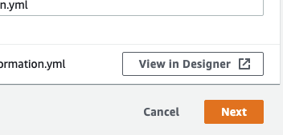

# **Turbocharging Reinforcement Learning with SageMakerRL**
--
**Authors :** Paul Conyngham & William Xu | StarAi Project Machine Learning Engineers - | Email : contact@starai.com

&nbsp;

&nbsp;

This workshop shows you how, using AWS, you can parallelise the training of your reinforcement learning algorithms to get insanely fast turn around times & results for your reinforcement learning experiments.

# Instructions

## Step 0 - Cloud Formation Installation

Click the "launch stack" button below to deploy your SageMaker RL stack. This will take you to the AWS console to setup the stack for this lab. Continue following the instructions here in order to complete the setup.

Or optionally scroll down for the command to launch the lab via a single command in the AWS Command Line Interface.

&nbsp;

&nbsp;

1. Step 1 of cloud formation is to specify a template. Do not change any of the settings here. Scroll down to the bottom of the page and click the orange "Next" button

&nbsp;

&nbsp;

2. Step 2 of cloud formation is to specify stack details. Same as before scroll down to the bottom of the page and click the orange "Next" button.
3. Step 3 is to configure stack options. Again, scroll to the bottom of the page and click Next.

&nbsp;

4. Step 4 is "Review". Scroll to the bottom of the page. This time click the "I acknowledge the AWS CloudFormation might create IAM resources check box". Once you the box is ticked please click the orange "Create Stack Button"

&nbsp;

&nbsp;

or if you have the Amazon Command Line Interface installed, setting up this lab is as easy as running the following command in your terminal:

`aws cloudformation create-stack --stack-name awsRLSummit2019 --template-body https://s3-ap-southeast-2.amazonaws.com/aws-summit-2019-rl/AWS-summit_RL-CloudFormation.yml --capabilities CAPABILITY_IAM`

&nbsp;

## Step 1 - Login to Sagemaker
&nbsp;

&nbsp;

1. Login to AWS Console
2. Click "Find Services"
3. Type "SageMaker" and hit enter

## Step 2 - open our Notebook instance

&nbsp;

1. On the left menu under the "Notebook" section, click "Notebook instances"

&nbsp;
&nbsp;

&nbsp;

2. Next to our instance named "amazon-RL-lab" there is a link called "open Jupyter", click it.

&nbsp;
&nbsp;

&nbsp;

3. A new tab will launch taking you to a jupyter notebook. Once this has finished loading, click the link titled "Summit-RL"

&nbsp;

&nbsp;

4. Clicking the link will take you to a new directory. Click the file titled **"Sagemaker_RL_Lab_Summit_2019_One_Click.ipynb"** to get started with the lab!

&nbsp;

&nbsp;

Please note that in some rare cases the Jupyter notebook may give you a pop up asking which kernel to use. If this happens to you please select "conda_tensorflow_p36" as the kernel of choice.

&nbsp;

The rest of the workshop continues in the Jupyter notebook. Follow the instructions there to continue to learn about distributed Reinforcement Learning with Sagemaker RL.
