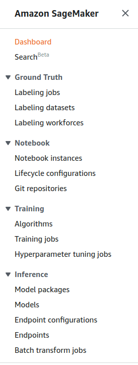
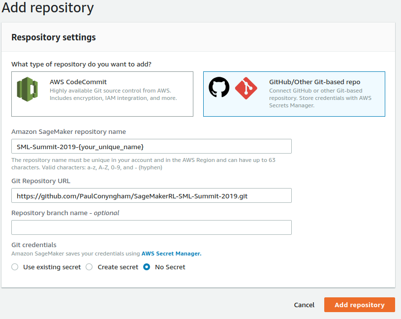
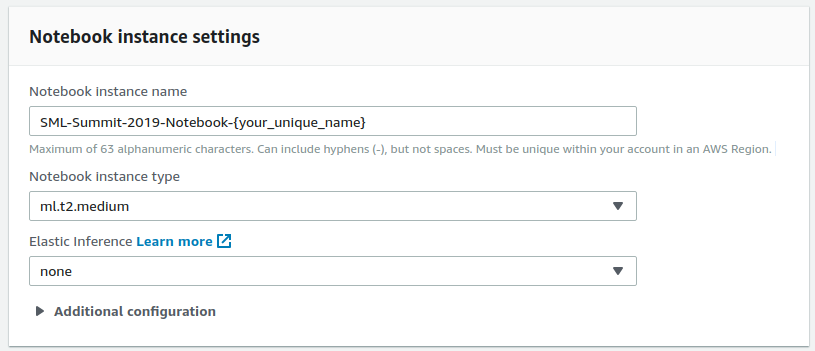
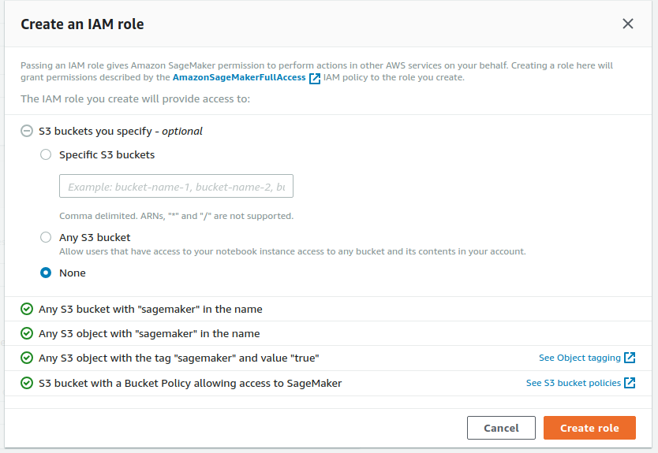

This workshop builds on top of the [Sagemaker Examples](https://github.com/awslabs/amazon-sagemaker-examples) to show you how, using AWS, you can parallelize the training of your reinforcment learning algorithms to get insanely fast turn around times & results for your reinforcement learning experiments.
  
# Instructions

## Step 1 - Login to Sagemaker
1. Login to AWS Console
2. Click "Services"
3. Click "Amazon SageMaker" under the "Machine Learning" category

## Step 2 - Adding a Git Repository to SageMaker
1. Select "Git repositories" on the left menu under the "Notebook" section

2. Click "Add Repository" on the right
3. Click "GitHub/Other Git-based repo"
4. Give the "Amazon SageMaker repository name" field a unique name.. e.g. SML-Summit-2019-{your_name}
5. Put in the URL: https://github.com/PaulConyngham/SageMakerRL-SML-Summit-2019.git
6. Select "No Secret" for Git credentials

## Step 3 - Create a new Notebook instance based on the new repo
1. Select "Notebook instances" on the left menu under the "Notebook" section
2. Click "Create notebook instance"
3. Under "Notebook instance settings": Enter a unique "Notebook instance name", leave the "Notebook instance type" and "Elastic Inference" on default

4. Under "Permissions and encription": choose "Create new" for "IAM role". Set the role accordingly. Then click on "Create role" to finalise. Leave other options deafult. (You should be able to view this new role in the IAM service) 

5. Under Git repositories, select the git repository you've just added above. 
6. Click on "Create notebook instance"

## Step 4 - Open and running Jupyter
1. Wait for the instance to be prepared, start the notebook if it's not "InService"
2. Click on "Open Jupyter", this will open it in a new tab
3. Click on "Sagemaker_RL_Lab_Summit_2019_Distributed.ipynb", it will open the notebook in another tab
4. Run notebook cells until the cell immediately after "Ray homogeneous scaling - Specify train_instance_count > 1"

### more content to add
- verifying the S3 buckets
- verifying the container in ECR
- Viewing the training & logs in "Training jobs" in SageMaker
