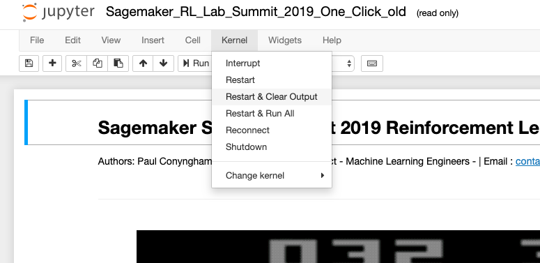

# **Turbocharging Reinforcement Learning with SageMakerRL**
--
**Authors :** Paul Conyngham & William Xu | StarAi Project Machine Learning Engineers - | Email : contact@starai.com

&nbsp;

&nbsp;

This workshop shows you how, using AWS, you can parallelise the training of your reinforcement learning algorithms to get insanely fast turn around times & results for your reinforcement learning experiments.

# Instructions

## Step 1 - Login to Sagemaker
&nbsp;

&nbsp;

1. Login to AWS Console
2. Click "Find Services"
3. Type "SageMaker" and hit enter

## Step 2 - open our Notebook instance

&nbsp;

1. On the left menu under the "Notebook" section, click "Notebook instances"

&nbsp;
&nbsp;

&nbsp;

2. Next to our instance named "BasicNotebookInstance" there is a link called "open Jupyter", click it.

&nbsp;
&nbsp;

&nbsp;

3. A new tab will launch taking you to a jupyter notebook. Once this has finished loading, click the link titled "Summit-RL"

&nbsp;

&nbsp;

4. Clicking the link will take you to a new directory. Click the file titled **"Sagemaker_RL_Lab_Summit_2019_One_Click.ipynb"**.

&nbsp;

&nbsp;

5. A new browser tab should open and launch a Jupyter notebook. Once the notebook has finished loading, from the top menu click **kernel**, then click **restart and clear output**. Your are now ready to get started with the lab!

&nbsp;

&nbsp;

Please note that in some rare cases the Jupyter notebook may give you a pop up asking which kernel to use. If this happens to you please select **"conda_tensorflow_p36"** as the kernel of choice.

&nbsp;

The rest of the workshop continues in the Jupyter notebook. Follow the instructions there to continue to learn about distributed Reinforcement Learning with Sagemaker RL.
